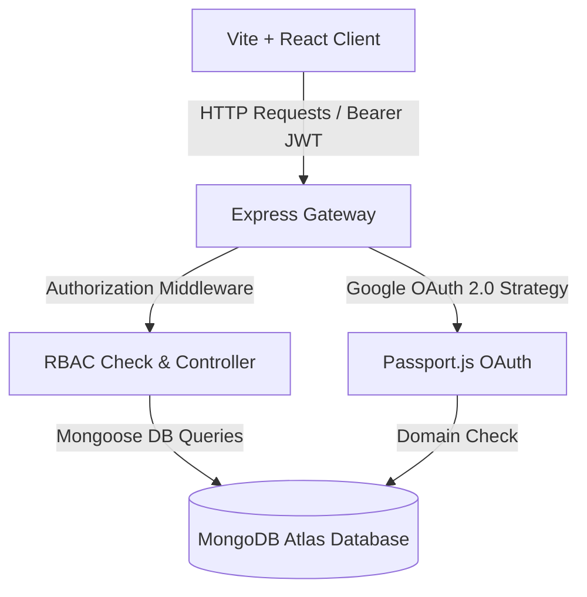

# System Architecture & Workflow Specifications

This document outlines the software design, database schemas, authentication controls, and data flow of the **Smart Classroom Booking and Utilization Management System**.

---

## 1. System Overview

---

## 2. Key Workflows & Rules

### A. Strict Domain Authentication Lock
- Only users with emails ending in `@bitsathy.ac.in` are allowed.
- Submissions or logins from other domains are rejected with `HTTP 403 Forbidden` response.
- Generated JWT tokens are signed using a secure secret key and contain user profile data (ID, email, name, role, department, year/semester).

### B. Dynamic 24-Hour Timeline & Overlap Protection
- Start/End timings are processed using continuous ISO 8601 timestamps (`startTime`, `endTime`) rather than fixed period intervals.
- The backend checks database records for overlaps:
  $$\text{Overlap Condition} \iff (\text{RequestedStart} < \text{ExistingEnd}) \land (\text{RequestedEnd} > \text{ExistingStart})$$
- Conflicting bookings return a descriptive error and block booking creation.

### C. Role-Based Access Control (RBAC) Matrix
- **Student**: View available classrooms, submit Join Requests, and verify attendance using 6-digit OTP codes.
- **Faculty**: Request classroom bookings, create custom student lists, dispatch broadcasts, and monitor OTP session check-ins.
- **Department Staff**: Direct room allocation privilege (bypasses approvals), approve/reject faculty bookings, handle manual attendance overrides, and manage session OTP countdowns.
- **Admin**: Full access, including registering physical room assets, global user governance, system metrics export, and configuration adjustments.

### D. Attendance Verification Cycle
1. Faculty or Staff selects an active booking and requests a **Live OTP Code**.
2. A random 6-digit code is generated and saved in the booking document with a **5-minute expiration timestamp**.
3. Students query the active code and check-in. The check-in updates the status in `AttendanceLog` to `PRESENT`.
4. Overrides: Staff and Admins can bypass OTP check-in by posting to the override route with a reason message, which sets the status and tags `lastUpdatedBy` with the modifier's credentials.
